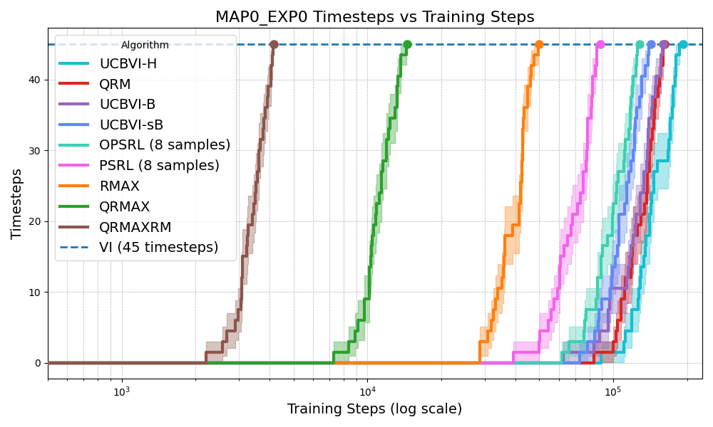
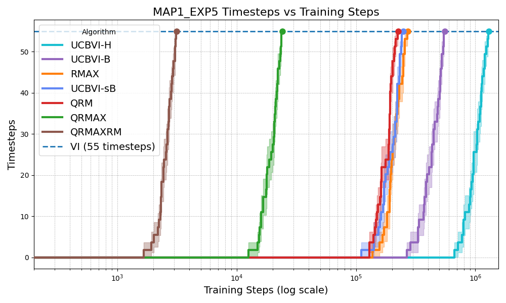
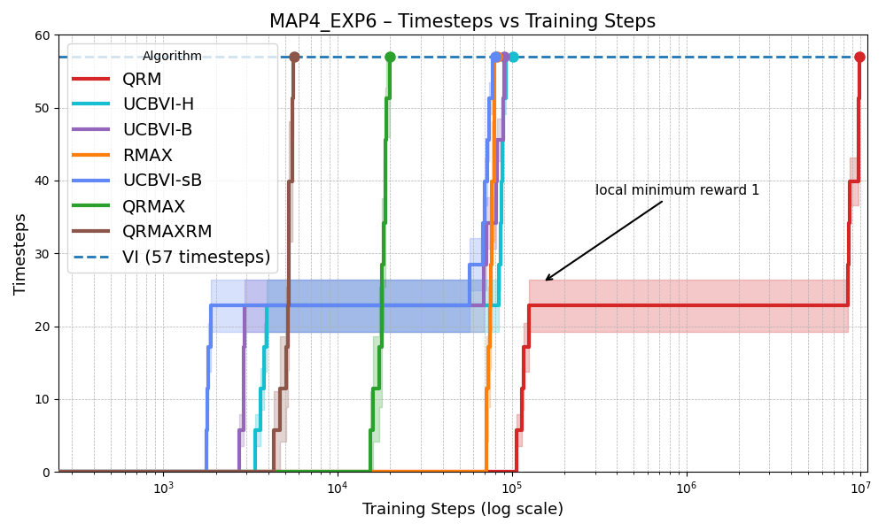
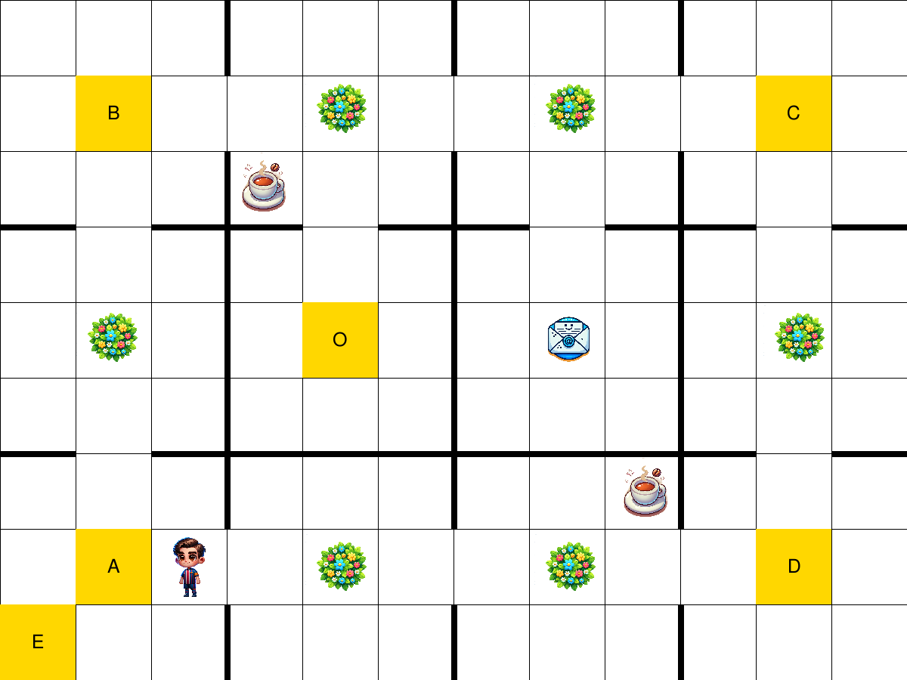
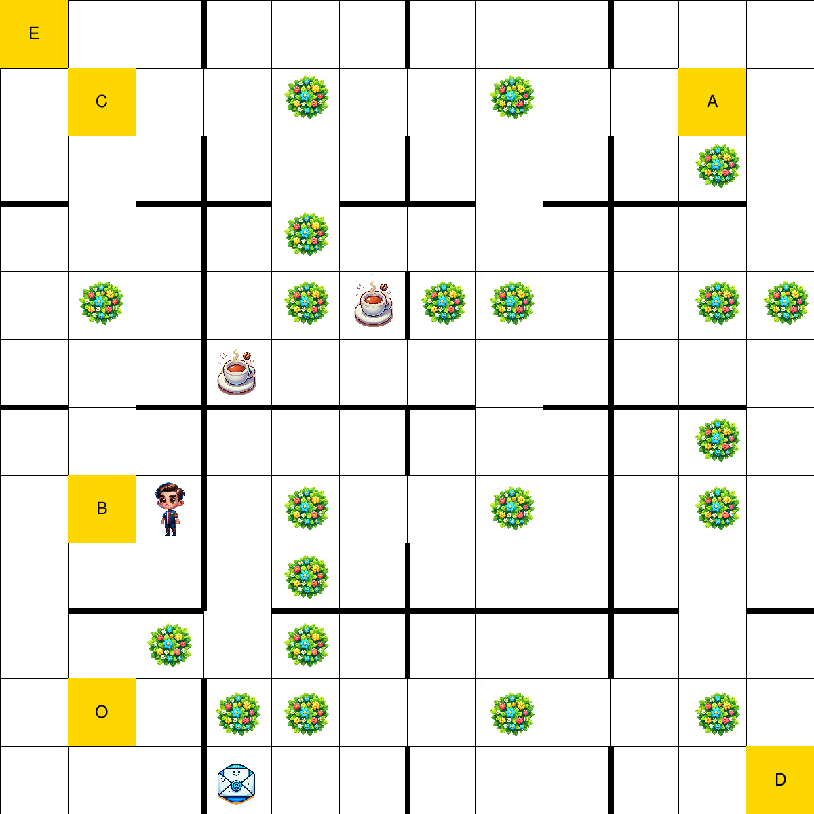
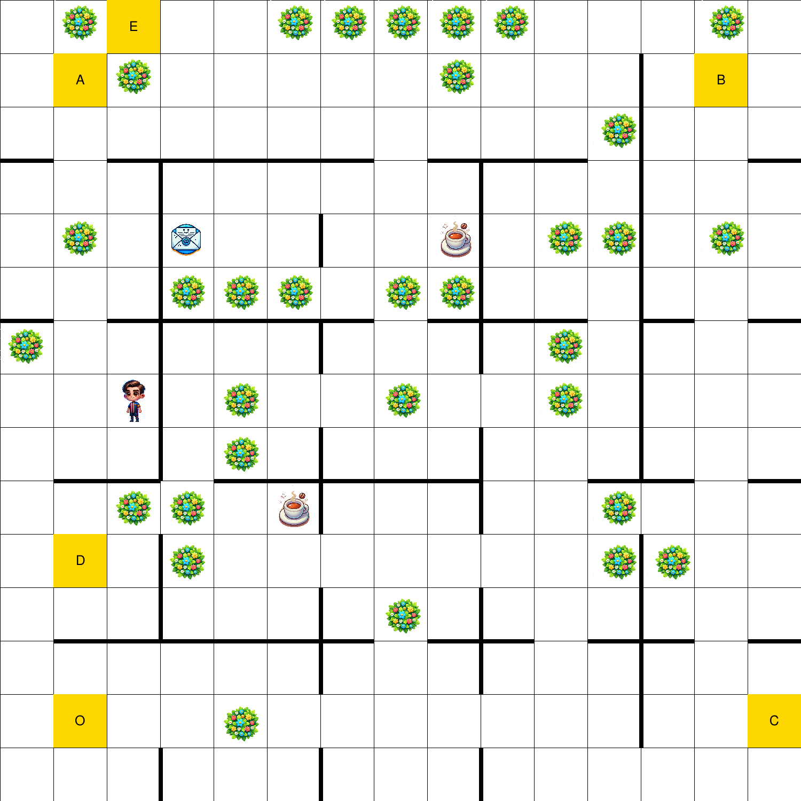

# QR-MAX

This repository contains the reproducibility package for:

> Model-Based Reinforcement Learning in Discrete-Action Non-Markovian Reward
> Decision Processes

Paper: https://arxiv.org/abs/2512.14617

Reusable implementation code lives in the companion library:

https://github.com/Alee08/multiagent-rl-rm

`qrmax` keeps only the experiment-facing pieces: pinned dependency metadata,
OfficeWorld experiment matrices, launchers, reproducibility notes, and
post-processing scripts.

## Dependency Freeze

This repository is pinned to the companion-library commit:

- package: `multiagent-rl-rm`
- package version: `0.3.0`
- OfficeWorld IJCAI tag: `v0.3.0-ijcai2026`
- pinned commit: `99b3fe3b0060bbd7e7f07eb3ef99930975d937f4`

The default `requirements.txt` installs the companion library from this frozen
commit. The pinned commit includes the OfficeWorld IJCAI code and the
continuous-line and continuous-corridor Bucket QR-MAX checks.

## Install

```bash
python -m venv .venv
source .venv/bin/activate
pip install -r requirements.txt
```

## Sanity Checks

Validate configured suite sizes:

```bash
python scripts/validate_config.py
```

Dry-run the smoke suite:

```bash
python scripts/reproduce_officeworld.py --suite smoke --dry-run
```

Run a short smoke experiment:

```bash
python scripts/reproduce_officeworld.py --suite smoke
```

Validate the continuous-line Bucket QR-MAX suites:

```bash
python scripts/validate_continuous_line_config.py
```

Validate the continuous-corridor Bucket QR-MAX suites:

```bash
python scripts/validate_continuous_corridor_config.py
```

Run the continuous-line smoke experiment:

```bash
python scripts/reproduce_continuous_line.py --suite continuous_line_smoke
```

Run the continuous-corridor smoke experiment:

```bash
python scripts/reproduce_continuous_corridor.py --suite continuous_corridor_smoke
```

## Experiment Suites

Suites are defined in `configs/officeworld_discrete.json`.

| Suite | Runs | Purpose |
| --- | ---: | --- |
| `smoke` | 1 | Fast local/CI sanity check. |
| `paper_main` | 300 | Three main OfficeWorld configurations. |
| `paper_table6` | 500 | Five configurations summarized in the paper table. |
| `paper_appendix_15` | 4500 | Appendix sweep over map1-map3, exp1-exp5, 30 seeds. |
| `officeworld_discrete` | 2100 | Full encoded OfficeWorld sweep. |

Run a suite:

```bash
python scripts/reproduce_officeworld.py --suite paper_main
```

Filter a larger suite without editing JSON:

```bash
python scripts/reproduce_officeworld.py \
  --suite officeworld_discrete \
  --algorithms QRMAX QRMAXRM \
  --maps map1 map2 \
  --seeds 0 1 2
```

The configured algorithm identifiers are the ones exposed by the frozen
OfficeWorld runner: `QL`, `QRM`, `RMAX`, `RMAXRM`, `QRMAX`, `QRMAXRM`,
`UCBVI-sB`, `UCBVI-B`, `UCBVI-H`, and `OPSRL`.

## Continuous-Line Bucket QR-MAX

The companion library also exposes a small continuous-state NMRDP sanity check
for Bucket QR-MAX. The task uses a one-dimensional continuous state, two
discrete actions, and a Reward Machine sequence `A -> B`.

Suites are defined in `configs/continuous_line_bucket_qrmax.json`.

| Suite | Runs | Purpose |
| --- | ---: | --- |
| `continuous_line_smoke` | 1 | Fast event-aware QR-MAX sanity check. |
| `bucket_event_ablation` | 2 | Compare naive buckets with event-aware buckets for QR-MAX. |
| `continuous_algorithm_comparison` | 6 | Compare QR-MAX, Q-learning, and R-MAX. |
| `continuous_bucket_sweep` | 6 | Sweep bucket granularity for QR-MAX. |
| `continuous_noise_sweep` | 8 | Sweep transition noise for QR-MAX. |

Run the QR-MAX event-ablation suite:

```bash
python scripts/reproduce_continuous_line.py --suite bucket_event_ablation
```

The included reference sweep is
`paper_results/continuous_line_bucket_qrmax_reference.csv`.

## Continuous-Corridor Bucket QR-MAX

The companion library also exposes a 2D continuous-state corridor check for
Bucket QR-MAX. The task uses state `(x, y)`, four discrete actions, low
transition noise, and a Reward Machine sequence `A -> B`.

Suites are defined in `configs/continuous_corridor_bucket_qrmax.json`.

| Suite | Runs | Purpose |
| --- | ---: | --- |
| `continuous_corridor_smoke` | 1 | Fast event-aware QR-MAX sanity check. |
| `bucket_event_ablation` | 2 | Compare plain buckets with event-aware buckets for QR-MAX. |
| `continuous_corridor_algorithm_comparison` | 3 | Compare Q-learning, R-MAX, and QR-MAX. |
| `continuous_corridor_y_bucket_sweep` | 4 | Sweep vertical bucket granularity for QR-MAX. |
| `continuous_corridor_hard_event_ablation` | 2 | Hard reset/noise event-ablation. |
| `continuous_corridor_hard_algorithm_comparison` | 3 | Hard reset/noise algorithm comparison. |

Run the QR-MAX corridor event-ablation suite:

```bash
python scripts/reproduce_continuous_corridor.py --suite bucket_event_ablation
```

Run the hard QR-MAX corridor event-ablation suite:

```bash
python scripts/reproduce_continuous_corridor.py --suite continuous_corridor_hard_event_ablation
```

The included reference sweep is
`paper_results/continuous_corridor_bucket_qrmax_reference.csv`.

## Outputs

The upstream OfficeWorld runner writes raw logs under `results/` and summary
text files named `results_<map>_<experiment>.txt`. These files are ignored by
Git.

Generate a compact aggregate CSV:

```bash
python scripts/summarize_officeworld.py \
  --results-dir results \
  --output paper_results/officeworld_summary.csv
```

The reported Table 6 OfficeWorld values from the paper are included as
`paper_results/table6_officeworld_steps.csv` for reference.
The extended 15-configuration OfficeWorld breakdown is included as
`paper_results/table4_officeworld_15_configs.csv`.
Continuous-line Bucket QR-MAX reference sweeps are included as
`paper_results/continuous_line_bucket_qrmax_reference.csv`.
Continuous-corridor Bucket QR-MAX reference sweeps are included as
`paper_results/continuous_corridor_bucket_qrmax_reference.csv`.

## Table 4: OfficeWorld 15-Configuration Breakdown

Training steps to reach the optimal policy compared with Value Iteration (VI).
The last two columns show the performance of the optimal solutions computed
through Value Iteration, highlighting the increasing difficulty of the task.

| Map | Exp | Q-Learning | R-MAX | QR-MAX | QRM | R-MAXRM | QR-MAXRM | Avg. Length (VI) | Success Rate (VI %) |
| --- | --- | ---: | ---: | ---: | ---: | ---: | ---: | ---: | ---: |
| Map1 | exp1 | 128,973 | 59,691 | **30,376** | 66,693 | 21,777 | **10,964** | 21.08 | 66.76 |
| Map1 | exp2 | 201,835 | 77,797 | **27,619** | 129,804 | 26,232 | **9,339** | 39.31 | 39.40 |
| Map1 | exp3 | 355,070 | 155,347 | **30,325** | 122,827 | 28,682 | **6,087** | 40.94 | 38.68 |
| Map1 | exp4 | 469,313 | 103,211 | **29,950** | 135,119 | 26,953 | **6,062** | 42.23 | 34.37 |
| Map1 | exp5 | 1,267,449 | 287,066 | **38,312** | 231,870 | 30,238 | **4,107** | 77.86 | 15.47 |
| Map2 | exp1 | 334,894 | 213,942 | **83,593** | 225,491 | 74,250 | **28,729** | 52.46 | 54.69 |
| Map2 | exp2 | 326,306 | 88,636 | **56,445** | 220,334 | 49,577 | **19,214** | 53.10 | 37.92 |
| Map2 | exp3 | 723,051 | 316,672 | **62,583** | 280,763 | 63,066 | **12,415** | 63.04 | 37.25 |
| Map2 | exp4 | 889,842 | 196,334 | **61,775** | 249,912 | 47,873 | **12,445** | 73.80 | 28.18 |
| Map2 | exp5 | 2,613,669 | 723,441 | **83,076** | 438,213 | 65,523 | **8,396** | 123.39 | 14.15 |
| Map3 | exp1 | 501,559 | 201,731 | **98,663** | 297,975 | 73,832 | **33,815** | 55.83 | 33.32 |
| Map3 | exp2 | 553,517 | 170,926 | **99,952** | 353,658 | 66,949 | **33,853** | 63.76 | 32.57 |
| Map3 | exp3 | 1,105,417 | 388,562 | **110,808** | 406,122 | 111,349 | **21,856** | 68.69 | 32.42 |
| Map3 | exp4 | 1,466,896 | 495,878 | **112,165** | 449,594 | 107,115 | **21,869** | 81.91 | 21.27 |
| Map3 | exp5 | 5,471,046 | 1,581,301 | **159,597** | 891,160 | 128,950 | **14,717** | 156.46 | 6.55 |

## Paper Figures

Main OfficeWorld configurations used in the paper:

<p align="center">
  
  
  
</p>

Base OfficeWorld maps used for the 15-configuration Table 4 sweep:

<p align="center">
  
  
  
</p>

See `REPRODUCIBILITY.md` for the full workflow.

## Citation

Use `CITATION.cff` for repository metadata. The final IJCAI citation can be
added once the camera-ready bibliographic metadata is available.
